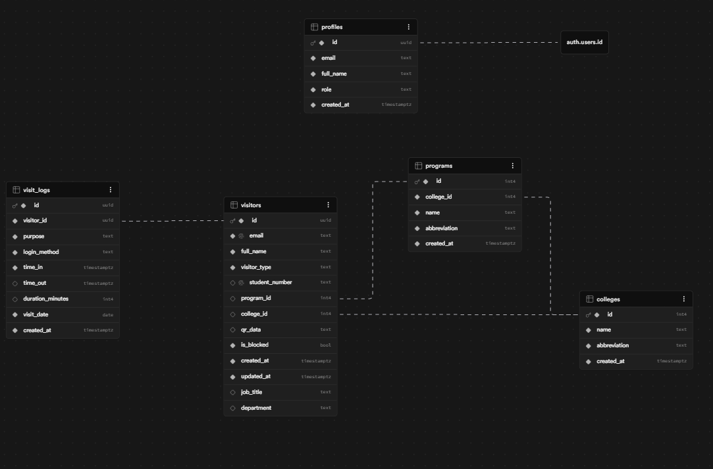

# NEU Library Visitor Log System

**Live Application:** https://neu-library-visitor-log.vercel.app
**GitHub Repository:** https://github.com/JomarAuditor/neu-library-visitor-log

---

## Table of Contents

1. [Project Overview](#project-overview)
2. [Tech Stack](#tech-stack)
3. [Architecture](#architecture)
4. [Folder Structure](#folder-structure)
5. [Database Schema](#database-schema)
6. [User Roles & Access](#user-roles--access)
7. [User Experience Flows](#user-experience-flows)
8. [Features](#features)
9. [Environment Variables](#environment-variables)
10. [Local Development](#local-development)
11. [Deployment](#deployment)
12. [Security](#security)

---

## Project Overview

The **NEU Library Visitor Log System** is a web-based kiosk and management system for New Era University's library. It replaces the traditional paper-based logbook with a digital check-in/out system using QR codes, email, or Google OAuth.

Library staff and administrators can view real-time visitor statistics, filter by purpose, college, or visitor type, and export data to CSV.

---

## Tech Stack

| Layer       | Technology                                     |
|-------------|------------------------------------------------|
| Frontend    | React 18 + TypeScript + Vite                   |
| Styling     | Tailwind CSS with custom NEU brand colors      |
| Backend     | Supabase (PostgreSQL + Auth + Realtime)        |
| Charts      | Recharts                                       |
| State       | TanStack Query (React Query)                   |
| Auth        | Supabase Auth + Google OAuth 2.0               |
| Deployment  | Vercel (frontend) + Supabase (backend)         |

---

## Architecture

```
┌─────────────────────────────────────────────────────┐
│                   VISITOR KIOSK                      │
│         (React SPA — Vercel CDN)                    │
│                                                      │
│  ┌──────────┐  ┌──────────┐  ┌──────────────────┐  │
│  │ QR Scan  │  │  Email   │  │  Google OAuth    │  │
│  │  Login   │  │  Login   │  │  (@neu.edu.ph)   │  │
│  └────┬─────┘  └────┬─────┘  └────────┬─────────┘  │
│       └─────────────┴─────────────────┘             │
│                       │                             │
└───────────────────────┼─────────────────────────────┘
                        │ HTTPS / REST
┌───────────────────────▼─────────────────────────────┐
│                   SUPABASE                           │
│                                                      │
│  ┌──────────────┐   ┌───────────────────────────┐  │
│  │  Supabase    │   │    PostgreSQL Database    │  │
│  │    Auth      │   │                           │  │
│  │  (Google     │   │  profiles                 │  │
│  │   OAuth)     │   │  colleges                 │  │
│  └──────────────┘   │  programs                 │  │
│                      │  visitors                 │  │
│  ┌──────────────┐   │  visit_logs               │  │
│  │  Row Level   │   │                           │  │
│  │  Security    │   └───────────────────────────┘  │
│  └──────────────┘                                   │
│                                                      │
│  ┌──────────────┐                                   │
│  │   pg_cron    │  Auto-timeout at 6PM PHT          │
│  └──────────────┘                                   │
└─────────────────────────────────────────────────────┘
```

---

## Folder Structure

```
neu-lib-visitor-system/
│
├── public/
│   ├── NEU Library logo.png        # Primary logo
│   └── neu-logo.svg                # Fallback SVG logo
│
├── supabase/
│   ├── schema.sql                  # Full DB schema (run first)
│   ├── seed.sql                    # Colleges & programs data
│   └── seed_v2.sql                 # Updated colleges + pg_cron setup
│
├── src/
│   ├── App.tsx                     # Route configuration
│   ├── main.tsx                    # Entry point
│   ├── index.css                   # Global styles + Tailwind
│   │
│   ├── types/
│   │   └── index.ts                # All TypeScript interfaces & constants
│   │
│   ├── lib/
│   │   ├── supabase.ts             # Supabase client initialization
│   │   └── utils.ts                # Helpers: formatters, validators, CSV export
│   │
│   ├── hooks/
│   │   ├── useAuth.tsx             # Auth context: signIn, signInWithGoogle, signOut
│   │   └── useStats.ts             # Data hooks: dashboard, logs, visitors, charts
│   │
│   ├── components/
│   │   ├── layout/
│   │   │   ├── AdminLayout.tsx     # Auth guard + sidebar wrapper
│   │   │   └── AdminSidebar.tsx    # Navigation sidebar + user profile strip
│   │   │
│   │   ├── admin/
│   │   │   ├── StatsCard.tsx       # Metric display card
│   │   │   ├── CollegeChart.tsx    # Pie chart — visitors by college
│   │   │   └── CourseChart.tsx     # Bar chart — visitors by course (abbreviation)
│   │   │
│   │   └── visitor/
│   │       ├── QRCodeDisplay.tsx   # Canvas QR code renderer
│   │       └── QRScanner.tsx       # Html5Qrcode camera scanner
│   │
│   └── pages/
│       ├── visitor/
│       │   ├── VisitorHome.tsx     # Main kiosk: QR / Email / Google login
│       │   ├── RegisterPage.tsx    # Registration form for all visitor types
│       │   └── WelcomePage.tsx     # Post-checkin confirmation screen
│       │
│       └── admin/
│           ├── AdminLogin.tsx      # Admin sign-in (email + Google)
│           ├── Dashboard.tsx       # Stats, filters, charts
│           ├── VisitorLogs.tsx     # Paginated log table + CSV export
│           └── UserManagement.tsx  # Manage visitors, roles, block/unblock
│
├── vercel.json                     # SPA rewrite rule (required for Vercel)
├── tailwind.config.js              # Custom NEU colors, shadows, animations
├── vite.config.ts                  # @ path alias
├── tsconfig.json                   # TypeScript config
└── README.md                       # This file
```

---

## Database Schema

The database is normalized to **Third Normal Form (3NF)**. No transitive dependencies. Each table has a single responsibility.

### Entity Relationship

```
auth.users (Supabase managed)
    │
    └──► profiles (1:1)
              id, email, full_name, role

colleges (1:N) ──► programs
    id                  id
    name                college_id (FK)
    abbreviation        name
                        abbreviation

visitors
    id
    email           ◄── unique, @neu.edu.ph only
    full_name
    visitor_type    ◄── 'student' | 'faculty' | 'staff'
    student_number  ◄── students only, nullable
    program_id      ◄── FK to programs, students only
    college_id      ◄── FK to colleges, optional for faculty
    department      ◄── faculty optional
    job_title       ◄── staff optional
    qr_data         ◄── encoded string for QR scan
    is_blocked

visitors (1:N) ──► visit_logs
                        id
                        visitor_id  (FK)
                        purpose     ◄── Reading | Research | Studying | Computer Use
                        login_method◄── QR Code | Email | Google
                        time_in
                        time_out    ◄── null = still inside
                        duration_minutes
                        visit_date
```

### Tables

| Table | Purpose | Key Columns |
|-------|---------|-------------|
| `profiles` | Admin accounts only | `id` = auth.users.id, `role` |
| `colleges` | NEU college list (16) | `name`, `abbreviation` |
| `programs` | Academic programs (50+) | `college_id`, `name`, `abbreviation` |
| `visitors` | All library users | `email`, `visitor_type`, `student_number?` |
| `visit_logs` | One row per library visit | `visitor_id`, `time_in`, `time_out`, `purpose` |

### Why 3NF?

- **1NF** — All columns are atomic (no repeating groups)
- **2NF** — No partial dependencies (programs depend on college_id, not a composite key)
- **3NF** — No transitive dependencies (college name is in `colleges`, not repeated in `programs` or `visitors`)



---

## User Roles & Access

| Role | How to Get It | What They Can Do |
|------|--------------|------------------|
| **Admin** | Auto-provisioned for whitelisted emails on first Google login | Full dashboard, stats, filters, user management, CSV export |
| **Student** | Register at `/register` with student number + college | QR/email/Google check-in at kiosk |
| **Faculty** | Register at `/register` or auto-register via Google | Google check-in (no employee ID needed) |
| **Staff** | Register at `/register` or auto-register via Google | Google check-in (no employee ID needed) |

### Admin Whitelist (auto-provisioned)
```
jcesperanza@neu.edu.ph
jomar.auditor@neu.edu.ph
```

### Security Rule
**Only `@neu.edu.ph` email addresses are allowed.** Non-NEU Google accounts are blocked at the `onAuthStateChange` level — they are signed out immediately after the OAuth callback if their email does not end in `@neu.edu.ph`.

---

## User Experience Flows

### Visitor Check-In (QR Code)
```
Kiosk (/) → Scan QR Code tab → Start Scanner
→ Point camera at QR → System verifies email + student number
→ If first visit of the day → Choose Purpose → Time In recorded
→ Welcome to NEU Library! screen (3 second redirect)
```

### Visitor Check-In (Email)
```
Kiosk (/) → Email tab → Enter @neu.edu.ph email
→ Students: also enter student number
→ Faculty/Staff: email only
→ System finds visitor record → Choose Purpose → Time In
→ Welcome to NEU Library! screen
```

### Visitor Check-Out
```
Same flow as check-in → System detects open session
→ Shows Time In time → Confirm Time Out
→ Duration calculated automatically
→ Thank You! screen
```

### Google Sign-In (First Time)
```
Kiosk (/) → Google tab → Sign in with Google (@neu.edu.ph only)
→ If Student → Redirected to /register to complete profile
→ If Faculty → One-click auto-register → immediately check in
→ If Staff → One-click auto-register → immediately check in
```

### Google Sign-In (Returning)
```
Kiosk (/) → Google tab → Sign in with Google
→ System finds visitor by email → Proceed to Time In / Time Out
```

### Admin Login (as Admin)
```
/admin/login → Sign in with Google (jcesperanza@neu.edu.ph)
→ Auto-provisioned as admin → Full dashboard
```

### Admin Login (as Visitor)
```
Kiosk (/) → Google tab → Sign in with admin email
→ System checks visitors table (not profiles)
→ Proceeds as a regular visitor check-in
→ Admin can use the library just like any other person
```

### Auto 6PM Timeout
```
pg_cron job runs at 10:00 UTC (= 18:00 PHT)
→ All visit_logs with time_out = NULL are automatically closed
→ duration_minutes calculated from time_in to 6PM
```

---

## Features

### Visitor Portal
- QR code scan using device camera (back camera preferred on mobile)
- Email login (student number optional for faculty/staff)
- Google OAuth login (NEU accounts only)
- Purpose selection: Reading, Research, Studying, Computer Use
- Time In / Time Out with automatic duration calculation
- Automatic 6PM timeout (via pg_cron)
- Registration for all visitor types (Student, Faculty, Staff)
- QR code download as PNG

### Admin Dashboard
- Visitor statistics: Today / This Week / Custom Date Range
- Displayed in stat cards (no emojis — professional icons)
- **Filter by Reason for Visit** (Reading, Research, Studying, Computer Use)
- **Filter by College** (all 16 NEU colleges with abbreviations)
- **Filter by Visitor Type** (Student, Faculty/Teacher, Staff/Employee)
- Currently Inside live counter (updates every 30 seconds)
- Purpose breakdown cards with click-to-filter
- Visitors by College — pie chart
- Visitors by Course — bar chart with abbreviations
- Export all filtered data to CSV

### User Management
- View all registered visitors
- Change visitor type (Student / Faculty / Staff) via dropdown
- Block / Unblock library access
- Promote visitor to admin
- Revoke admin access
- View all current admin accounts

---

## Environment Variables

Create `.env` in the project root:

```env
VITE_SUPABASE_URL=https://YOUR_PROJECT_ID.supabase.co
VITE_SUPABASE_ANON_KEY=your_supabase_anon_key
```

Get these from: Supabase Dashboard → Project Settings → API

---

## Local Development

```bash
# 1. Install dependencies
npm install
npm install -D @types/node

# 2. Create .env file with your Supabase credentials

# 3. Run the database setup in Supabase SQL Editor:
#    First: supabase/schema.sql
#    Then:  supabase/seed_v2.sql

# 4. Start development server
npm run dev

# 5. Open http://localhost:5173
```

---

## Deployment

```bash
# Stage all changes
git add .

# Commit with descriptive message
git commit -m "feat: complete NEU Library Visitor Log System"

# Push to GitHub (Vercel auto-deploys on push)
git push origin main
```

### Vercel Setup (first time only)
1. Connect GitHub repo to Vercel
2. Add environment variables in Vercel Dashboard → Project → Settings → Environment Variables:
   - `VITE_SUPABASE_URL`
   - `VITE_SUPABASE_ANON_KEY`
3. Vercel auto-detects Vite — no build config needed
4. `vercel.json` handles the SPA rewrite rule (prevents white screen on direct URL access)

### Supabase Setup (first time only)
1. Run `schema.sql` in SQL Editor
2. Run `seed_v2.sql` in SQL Editor
3. Authentication → Providers → Google → Enable with Client ID and Secret
4. Authentication → URL Configuration → Add redirect URLs:
   ```
   https://neu-library-visitor-log.vercel.app/admin/login
   https://neu-library-visitor-log.vercel.app/
   http://localhost:5173/admin/login
   http://localhost:5173/
   ```
5. Enable pg_cron extension: Database → Extensions → pg_cron → Enable

---

## Security

| Concern | Implementation |
|---------|---------------|
| Email restriction | Only `@neu.edu.ph` addresses accepted. Enforced in `useAuth.tsx` at `onAuthStateChange` — non-NEU accounts are signed out immediately |
| Admin access | Role stored in `profiles` table. `AdminLayout.tsx` checks role before rendering any admin page |
| Row Level Security | All tables use Supabase RLS. Visitors can only insert/read. Only admins can update visitor records |
| Route protection | `/admin/*` routes are wrapped in `AdminLayout` which redirects unauthenticated users to `/admin/login` |
| QR code encoding | QR data is `email|studentnumber` — not personally identifiable without the system |
| HTTPS | Enforced by Vercel and Supabase |

---

## License

New Era University — College of Informatics and Computing Studies
Academic Project — Library Visitor Log System — 2026